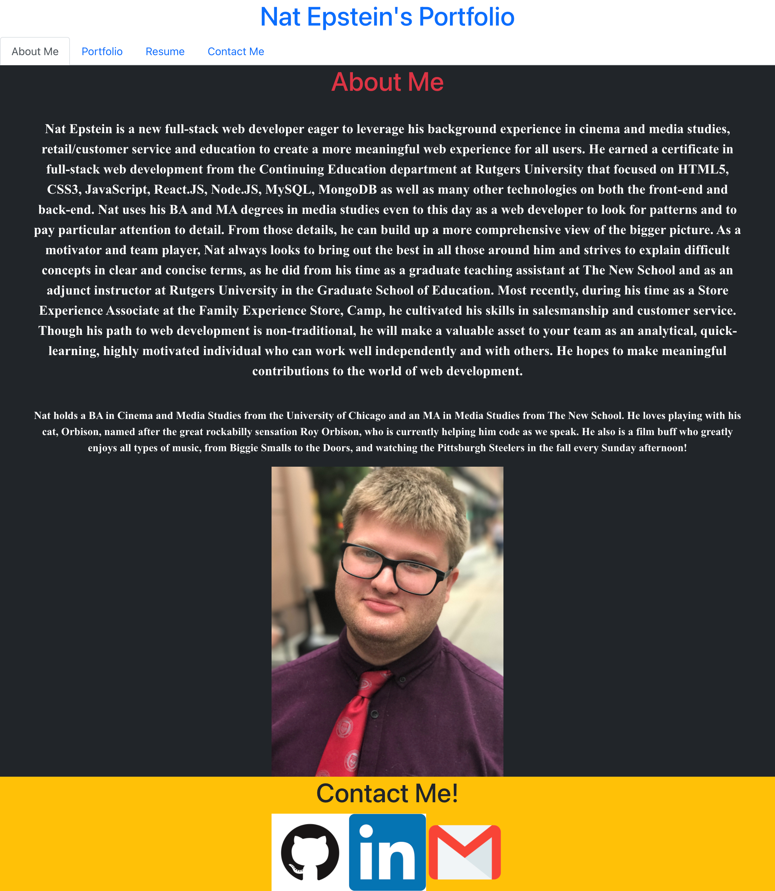

# React-Portfolio 

Project Name: React-Portfolio

## Description
Description: Created a new professional react portfolio from scratch. Added header and section semantic elements and had three sections for: About Me, Work, and Contact Me. 

## Table of Contents
 * [Technologies](#technologies)
 * [URLs](#urls)
 * [Screenshot](#screenshot)

## Technologies: 
HTML5, CSS3, Javascript, React.js

## URLs: 

[napitt2393/React-Portfolio](https://github.com/natpitt2393/React-Portfolio)
[React-Portfolio](https://natpitt2393.github.io/React-Portfolio/) 

## Screenshot

License:
Copyright (c) 2021 Nathaniel Epstein
