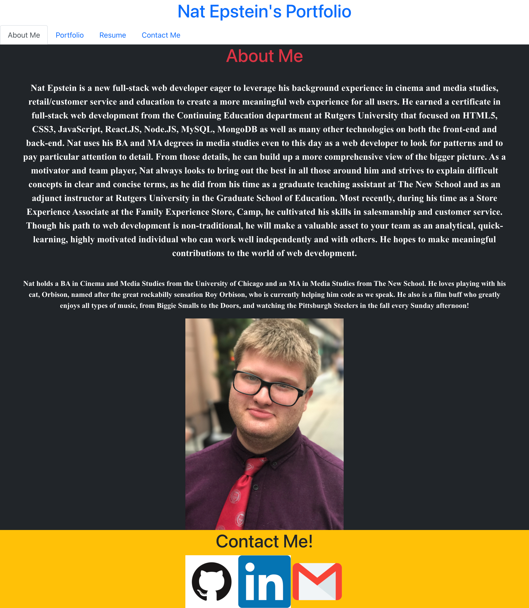

# React-Portfolio 

Project Name: React-Portfolio

## Description
Description: Created a new professional react portfolio from scratch. I have sections for About Me, Resume, Portfolio and Contact Me. Each page can be rendered by pushing on the appropriate tab in the nav bar. Each page will have the same footer and header that are components.

## Table of Contents
 * [Technologies](#technologies)
 * [URLs](#urls)
 * [Screenshot](#screenshot)

## Technologies: 
HTML5, CSS3, Javascript, React.js

## URLs: 

[napitt2393/React-Portfolio](https://github.com/natpitt2393/React-Portfolio)
[React-Portfolio](https://natpitt2393.github.io/React-Portfolio/) 

## Screenshot

License:
Copyright (c) 2021 Nathaniel Epstein
